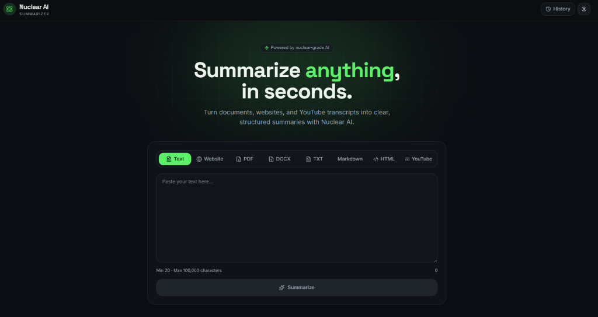

# ⚛️ Nuclear-AI Summarizer

An advanced, full-stack AI-powered summarization engine designed to distill documents, websites, transcripts, and raw text into concise, structured highlights within seconds.



---

## 🚀 Key Features

* **8 Input Sources Supported**:
  * **Plain Text**: Direct copy-paste up to 100,000 characters.
  * **Website URLs**: Scrapes HTML, filters tags, and summarizes target page content.
  * **YouTube Videos**: Dynamically fetches transcriptions (via `youtube-transcript`). Automatically falls back to oEmbed metadata (title, author, description) if subtitles are disabled.
  * **PDF Documents**: Upload files directly. Leverages **multimodal AI capabilities** to ingest and analyze PDF layouts.
  * **Markdown (.md)**: Upload and summarize documentation files.
  * **HTML (.html)**: Upload webpage templates to extract and summarize.
  * **Plain Text Files (.txt)**: Quick text file imports.
  * *Note: DOCX is UI-ready (backend alerts users to convert to PDF).*
* **Custom Summary Lengths**: Instantly toggle summaries between **Short**, **Medium**, and **Detailed** versions with automated re-generation and local caching.
* **Granular Highlights**: Every result produces:
  * **Descriptive Title**: Focused title under 90 characters.
  * **Structured Summary**: Concise, high-level summary paragraphs.
  * **Key Highlights**: Bullet points capturing the most crucial insights.
  * **Topical Keywords**: Tagged search keywords.
  * **Readability Metrics**: Estimates original word count and reading time.
* **Persistent History Tracker**: Log of past runs is saved securely in your browser's local storage for easy recovery.
* **Interactive UI/UX**: Premium dark-mode user interface with a custom grid background, glowing accents, and smooth Framer Motion transitions.

---

## 🛠️ Technology Stack (MERN)

* **Backend Server**: [Express.js](https://expressjs.com/) for constructing secure RESTful APIs to process inputs and manage summaries.
* **Frontend Interface**: [React](https://react.dev/) to build the responsive, single-page application and manage UI transitions.
* **Runtime**: [Node.js](https://nodejs.org/) powering the execution of the backend server logic and ecosystem packages.
* **AI Core**: [Vercel AI SDK](https://sdk.vercel.ai/) backed by Google Gemini's **gemini-2.5-flash** model.
* **Styling**: [Tailwind CSS](https://tailwindcss.com/) for modern glassmorphic components, fluid grids, and dark-theme aesthetics.

---

## 🏃 Getting Started

### Prerequisites
Make sure you have [Node.js](https://nodejs.org/) (v18+) and [Bun](https://bun.sh/) (or `npm`) installed.

### 1. Clone the Repository
```bash
git clone https://github.com/RIKKY-J/Nuclear-AI.git
cd Nuclear-AI
```

### 2. Environment Setup
Create a `.env` file in the root of the project:
```bash
cp .env.example .env
```
Open `.env` and add your Google Gemini API Key:
```env
GEMINI_API_KEY=your_gemini_api_key_here
```
> **Important**: Never commit your `.env` file. It has been pre-configured in `.gitignore` to keep credentials safe.

### 3. Install Dependencies
Using **Bun** (recommended):
```bash
bun install
```
Using **npm**:
```bash
npm install
```

### 4. Run the Development Server
Using **Bun**:
```bash
bun dev
```
Using **npm**:
```bash
npm run dev
```

Open [http://localhost:3000](http://localhost:3000) in your browser to start summarizing.
